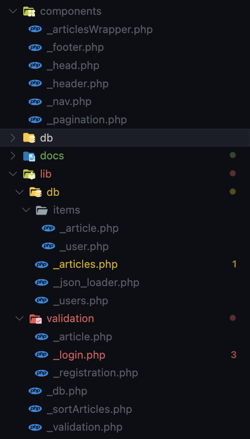

# Project ZWA Andrii Nehalchuk

Table of content:

- [Project ZWA Andrii Nehalchuk](#project-zwa-andrii-nehalchuk)
- [Popis úlohy](#popis-úlohy)
  - [Popis úlohy](#popis-úlohy-1)
  - [Uživ. příručka](#uživ-příručka)
  - [Popis implementace](#popis-implementace)
  - [Popis úložiště dat](#popis-úložiště-dat)
- [Uživatelská příručka](#uživatelská-příručka)
  - [Popis funkčnosti webu](#popis-funkčnosti-webu)
  - [Ukázky UI webu](#ukázky-ui-webu)
- [Popis implementace](#popis-implementace-1)
  - [Popis hlavních rysů programu (funkčnost hlavních skriptů)](#popis-hlavních-rysů-programu-funkčnost-hlavních-skriptů)
  - [Dokumentace ve zdrojovém kódu](#dokumentace-ve-zdrojovém-kódu)
  - [Vygenerovaná dokumentace ze zdrojového kódu](#vygenerovaná-dokumentace-ze-zdrojového-kódu)

# Popis úlohy 
## Popis úlohy 

`Nezávislé Publikování` - je webová stránka, kde můžete psát články a nemusíte se obávat, že je služba změní, protože každý článek má svůj vlastní jedinečný hash založený na všech informacích, které článek obsahuje.

## Uživ. příručka

Pro zobrazení článků nemusíte být registrováni.

Ale pokud se chcete podělit o své myšlenky, můžete se zaregistrovat a napsat, co vás trápí.

## Popis implementace

Web se skládá z celkem 5 stránek:
1. Hlavní - kde jsou všechny články
2. Profil - kde jsou vaše informace a všechny vaše články.
3. Přihlášení - pokud nejste přihlášeni ke svému profilu.
4. Registrace - pokud nemáte profil.
5. O službě - všechny publikace o službě

## Popis úložiště dat

Všechny informace jsou uloženy ve formátu json v souboru `./db/db.json`.

- users - seznam uživatelů
  - uid - každý uživatel je vázán na svůj vlastní jedinečné ID
    - uid - jedinečné ID uživatele
    - username - uživatelské jméno
    - fname - jméno
    - lname - příjmení
    - hash - solené heslo

- articles - seznam článků
  - aid - každý článek je spojen s jedinečným id
    - aid - jedinečné identifikátor článku
    - uid - ID uživatele
    - title - název
    - text - text
    - date - datum publikace
    - hash - jedinečný hash, který se skládá ze všech informací v článku

# Uživatelská příručka
## Popis funkčnosti webu 
Musíte si nejprve vytvořit účet na profilové stránce.

Zadejte všechny potřebné informace.

Pak se systém automaticky přihlásí

A pak můžete psát, co chcete.

Všechny články uživatelů budou k dispozici na domovské stránce.

## Ukázky UI webu 

Stránky fungují dobře na velkých i malých obrazovkách:

Je také možné změnit téma na světlé nebo tmavé:

Také samostatně navržené registrační formuláře tak, aby byly na větších obrazovkách ještě menší než články:

existuje také samostatný styl pro tiskárnu, kde jsou vykresleny všechny nepotřebné prvky.

# Popis implementace
## Popis hlavních rysů programu (funkčnost hlavních skriptů) 

Všechny kódy jsou pečlivě uspořádány do souborů a složek pro lepší přehlednost:

Vše bylo napsáno od začátku - jak práce s databází, tak styly a zpracování formulářů. 

Kód je jednoduchý a nekomplikovaný, s výjimkou stránkování a filtrování, ale jakmile si ho osvojíte, není ani příliš složitý.

## Dokumentace ve zdrojovém kódu

Ano.

## Vygenerovaná dokumentace ze zdrojového kódu

Ne.