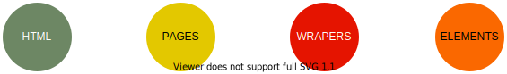
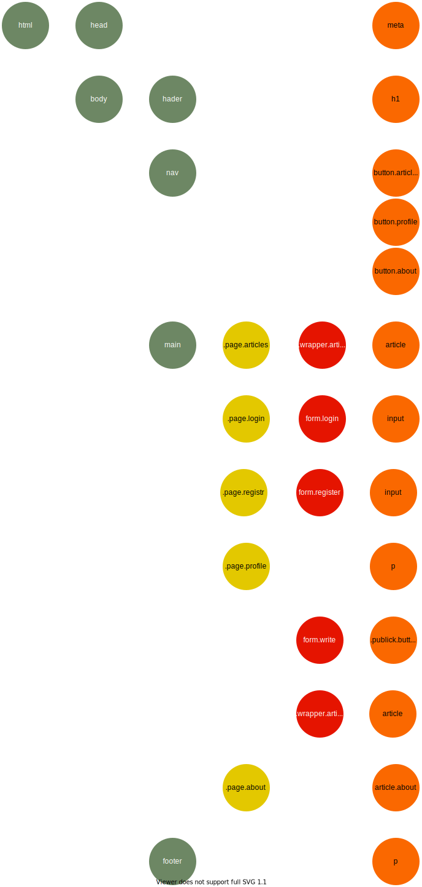

# Obsah
- [Obsah](#obsah)
- [Zásadní požadavky](#zásadní-požadavky)
- [O projectu](#o-projectu)
    - [Nazev](#nazev)
    - [Cíl](#cíl)
    - [Popis](#popis)
    - [Výčet implementovaných stránek](#výčet-implementovaných-stránek)
    - [Uživatelské role](#uživatelské-role)
    - [Funkce](#funkce)
    - [DOM](#dom)

# Zásadní požadavky
- Student musí prokázat, že práci udělal sám!
- Práce musí fungovat v plném rozsahu. Pokud pokročilý student odevzdává jen některou podčást většího celku, musí toto být jasně řečeno již v zadání práce.
- Serverová strana aplikace musí být v PHP
- Kód musí být dokumentován

# O projectu
## Nazev
- `Publikační servis "Nezávislé Publikování"`

## Cíl 
- Umožnit komunitě uživatelů psát vkazy na web.

## Popis:
- Bude to web, kde může kdokoli publikovat články a mít jistotu, že je žádný správce nezmění.
- Každý hash publikace obsahuje hash předchozí publikace a vytváří tak řetězec závislostí.
- Autor, aby se ujistil, že všechny články jsou původní, musí pouze porovnat svůj poslední publikační hash se skutečným publikačním hashem.
- Všechny publikace a kódy hashe budou přístupné všem. 

## Výčet implementovaných stránek
- Publikace
- Moje publikace
- O servisu

## Uživatelské role:
- Nepřihlášení uživatelé - čtenář
- Přihlášení uživatelé - spisovatel

### Funkce:
- Vzkaz obsahuje titulek, jméno autora, datum přidání a text.
- Vzkazy jsou rozděleny do kategorií.
- Kategorie jsou pevně dané, upravovat je může jenom správce fóra.
- Na hlavní stránce fóra je vypsaných posledních 10 vzkazů a seznam kategorií, každá kategorie obsahuje seznam příslušných vzkazů, seznamy jsou stránkovány.

### Funkce podle rolí:
- Nepřihlášení uživatelé můžou číst všechny vzkazy, registrovat se, případně se přihlásit.
- Běžní přihlášení uživatelé můžou psát vzkazy a můžou mazat a upravovat svoje vlastní vzkazy.
- Správce fóra může psát vzkazy, blokovat nebo povolovat běžné přihlášené uživatele, vytvářet, editovat a mazat kategorie, mazat a editovat všechny příspěvky.

## DOM

Označení
 

Schéma

